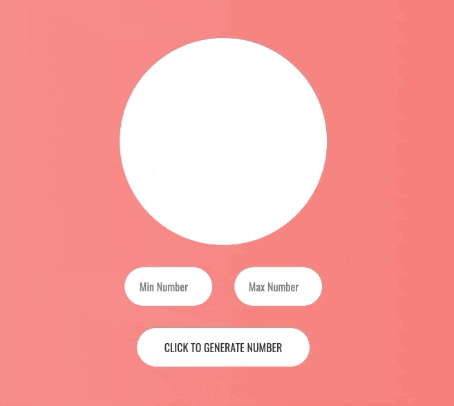

<h2 align="center">Random Number Generator</h2>

A simple random number generator that will allow you to select minimum and maximum values to generate a number between and then generate and display the number once the button is clicked.

<br />

```js
document.querySelector('.numberGenerator').addEventListener('click', function() {

  //// Set minimum and maximum numbers
  var minEntry = parseInt(document.querySelector('.minimumNumber').value);
  var maxEntry = parseInt(document.querySelector('.maximumNumber').value);

  //// Create variable with random number from given range
  var randomNumber = Math.floor(Math.random() * (maxEntry - minEntry + 1) + minEntry);

  //// Display randomly generated number
  document.querySelector('.number').textContent = randomNumber;
  
});
```
<br />


